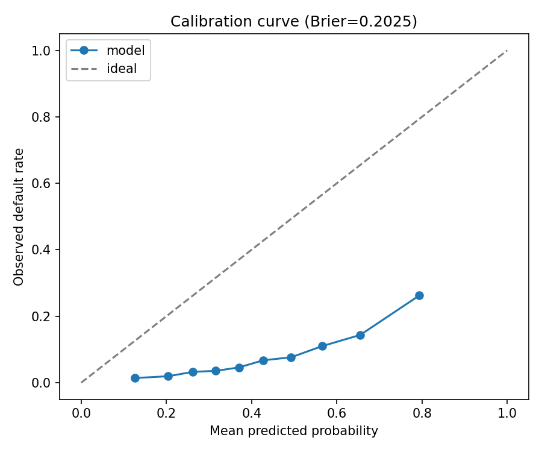
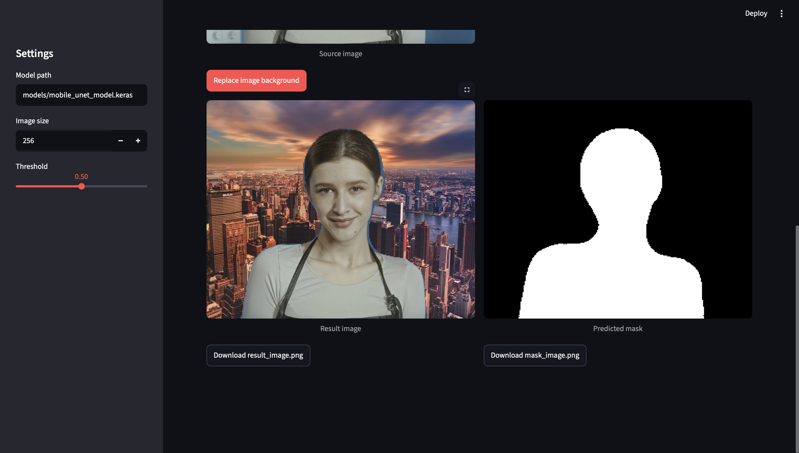
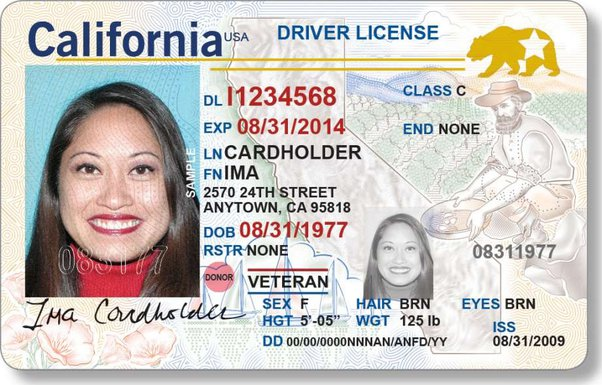
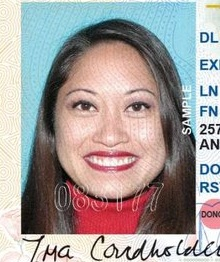
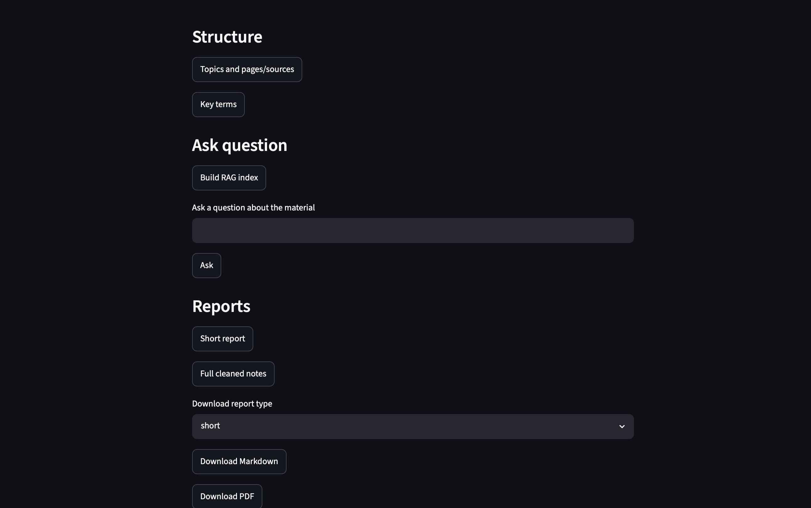

# Machine Learning Portfolio

A collection of end-to-end Machine Learning, Deep Learning, Computer Vision,
NLP, LLM and AI Agent projects developed throughout my studies and independent
practice.

The repository demonstrates practical work ranging from classical machine
learning on tabular data to neural-network segmentation, document and media
processing, retrieval-augmented generation, and tool-using AI agents. Each
project remains self-contained, with its own dependencies and run instructions.

## About Me

I am developing applied machine-learning engineering skills through complete
projects: problem framing, data and model pipelines, evaluation, testing,
documentation, and user-facing interfaces. I focus on reproducible work that
can be inspected and run outside a notebook.

## Learning Journey

The portfolio combines projects created during study and independent practice.
The original Git histories were retained during consolidation, so their
authors, commit messages, and commit dates remain available in this monorepo.

| First recorded Git activity | Project milestone | Skills demonstrated |
|---|---|---|
| 24 June 2026 | Student AI Agent for Telegram | LLM agents, tool calling, RAG, vector search |
| 25 June 2026 | Person Background Replacement | Deep learning, segmentation, image/video inference |
| 28 June 2026 | AI Lecture / Meeting Summarizer | NLP pipelines, speech-to-text, RAG, API and web UI |
| 27 July 2026 | Credit Scoring System first recorded in Git | Tabular ML, leakage-safe validation, evaluation and CLI inference |

The dates above are repository evidence, not claims about when learning began
or when every part of a project was completed.

| Stage | Area | Demonstrated by |
|---|---|---|
| Data analysis | Python, pandas, NumPy | Credit Scoring System |
| Classical ML | scikit-learn, CatBoost, validation and calibration analysis | Credit Scoring System |
| Deep Learning | TensorFlow/Keras, Mobile U-Net | Person Background Replacement |
| NLP applications | FastAPI, Whisper, TF-IDF, document and media processing | AI Lecture / Meeting Summarizer |
| AI agents | LangChain, ChromaDB, tool calling, dialogue memory | Student AI Agent for Telegram |

## Featured Projects

| Project | Area | Main outcome | Status |
|---|---|---|---|
| [Credit Scoring System](classical-ml/credit-scoring-system/) | Classical ML | Reproducible probability-of-default pipeline with evaluation and CLI inference | Ready with documented limitations |
| [Person Background Replacement](computer-vision/person-background-replacement/) | Deep Learning / CV | Mobile U-Net person segmentation for image and video background replacement | Portfolio project; deployment URL retained |
| [Automatic Face Cropper](computer-vision/automatic-face-cropper/) | Computer Vision | Face detection and rectangular cropping with Haar Cascade, YuNet and batch processing | Ready |
| [AI Lecture / Meeting Summarizer](nlp-llm/ai-lecture-meeting-summarizer/) | NLP / LLM | Document, audio, video and YouTube processing with reports, exports and RAG Q&A | Portfolio MVP |
| [Student AI Agent for Telegram](ai-agents/student-ai-agent-telegram/) | AI Agents / RAG | Telegram assistant with tools, local-material retrieval and conversation memory | Portfolio project |

## Classical Machine Learning

### Credit Scoring System

An end-to-end credit-risk project based on the Home Credit Default Risk
dataset. `TARGET = 1` means that a client had payment difficulties; the model
estimates that default-risk probability.

Key capabilities:

- input-data validation and feature engineering across Home Credit tables;
- leakage-safe train/holdout separation and out-of-fold validation;
- baseline and CatBoost research experiments;
- a saved Logistic Regression bundle containing preprocessing, schema,
  threshold and risk bands;
- ROC-AUC, Average Precision, Brier score, KS statistic and classification
  metrics;
- calibration, score-distribution, error and feature-importance reports;
- training, evaluation and batch-prediction CLI commands;
- automated tests and local/Google Colab compatibility checks.

The strongest saved notebook research result is CatBoost with application and
POS_CASH features: **3-fold CV ROC-AUC 0.761249 ± 0.001983**. Its notebook
Average Precision output is invalid, so it is not published as the production
artifact. The selected runnable bundle is Logistic Regression because its full
preprocessing and evaluation path is reproducible:

| Metric | OOF CV | Holdout |
|---|---:|---:|
| ROC-AUC | 0.744901 ± 0.002525 | 0.748600 |
| Average Precision | 0.217928 ± 0.005275 | 0.228541 |
| Brier score | — | 0.202536 |
| KS statistic | — | 0.372498 |
| F1 at OOF-selected threshold | — | 0.295140 |



[Open Credit Scoring System](classical-ml/credit-scoring-system/)

## Deep Learning & Computer Vision

### Person Background Replacement

A person-segmentation application built around a Mobile U-Net architecture
with a MobileNetV2 encoder. It predicts a person mask and composites the
foreground onto a replacement background.

Key capabilities:

- TensorFlow/Keras segmentation inference;
- image and frame-by-frame video processing;
- command-line interfaces for images and videos;
- Streamlit web interface;
- trained model stored with Git LFS;
- sample inputs and visual output artifacts.

No model-quality metric is reported in the source project, so none is inferred
here.



[Open Person Background Replacement](computer-vision/person-background-replacement/)
· [Open Streamlit deployment](https://ml-portfolio-qruttxsi28wzsfxkugjanc.streamlit.app)

### Automatic Face Cropper

A practical Computer Vision utility originally created for a freelance task. It
detects faces in an image, selects the largest bounding box, expands the
detected region and saves the resulting face crop as a separate image.

Key capabilities:

- single-image processing through a command-line interface;
- Haar Cascade and OpenCV YuNet face detectors;
- automatic selection of the largest detected face;
- configurable bounding-box expansion and rectangular face cropping;
- optional rotation checks at 0°, 90°, 180° and 270°;
- batch processing with CSV reports;
- safe handling of corrupted images;
- skipping existing outputs and forced processing through `--overwrite`.

The project performs face detection and rectangular cropping rather than
pixel-level face or head segmentation.

<table>
  <tr>
    <th align="center">Input</th>
    <th align="center">Haar Cascade</th>
    <th align="center">YuNet</th>
  </tr>
  <tr>
    <td align="center">
      
    </td>
    <td align="center">
      
    </td>
    <td align="center">
      
    </td>
  </tr>
</table>

[Open Automatic Face Cropper](computer-vision/automatic-face-cropper/)

## NLP & LLM Applications

### AI Lecture / Meeting Summarizer

A FastAPI and Streamlit application that processes documents, audio, video and
YouTube transcripts into searchable learning materials, structured summaries
and downloadable reports.

Key capabilities:

- PDF, DOCX, text, audio, video and YouTube ingestion;
- faster-whisper speech-to-text and FFmpeg media extraction;
- topic and term extraction;
- local TF-IDF retrieval and RAG-style Q&A;
- optional OpenRouter-compatible LLM generation with deterministic local
  fallbacks;
- Markdown, PDF and DOCX exports;
- Docker Compose setup and a safe offline-focused test suite.

The current retrieval implementation uses TF-IDF and cosine similarity rather
than an embedding vector database. The project is documented as a portfolio
MVP, not a multi-user production service.



[Open AI Lecture / Meeting Summarizer](nlp-llm/ai-lecture-meeting-summarizer/)

## AI Agents & RAG

### Student AI Agent for Telegram

A Telegram assistant backed by an OpenRouter-compatible LLM and LangChain. The
agent selects tools, retrieves context from local study materials and maintains
short-term dialogue memory.

Key capabilities:

- Telegram Bot API integration;
- tool calling for calculations, current time, MIET schedules, hh.ru vacancies
  and Profi.ru links;
- RAG over local TXT, Markdown and PDF files;
- ChromaDB storage with Hugging Face sentence-transformer embeddings;
- conversation-window memory and summaries;
- pytest coverage for deterministic tools and Telegram integration behavior.

Running the bot requires user-provided Telegram and OpenRouter credentials;
example environment values contain placeholders only.

[Open Student AI Agent](ai-agents/student-ai-agent-telegram/)

## Repository Structure

```text
ml-portfolio/
├── README.md
├── .gitignore
├── .gitattributes
├── assets/
│   └── portfolio/
├── classical-ml/
│   └── credit-scoring-system/
├── computer-vision/
│   ├── automatic-face-cropper/
│   └── person-background-replacement/
├── nlp-llm/
│   └── ai-lecture-meeting-summarizer/
└── ai-agents/
    └── student-ai-agent-telegram/
```

## Technology Stack

| Area | Technologies used in the portfolio |
|---|---|
| Data and classical ML | Python, pandas, NumPy, scikit-learn, CatBoost, joblib |
| Deep learning and CV | TensorFlow, Keras, MobileNetV2, OpenCV, Pillow |
| APIs and interfaces | FastAPI, Uvicorn, Streamlit, Telegram Bot API |
| NLP and media | faster-whisper, FFmpeg, pypdf, python-docx, ReportLab |
| LLM and retrieval | OpenAI-compatible APIs, OpenRouter, LangChain, ChromaDB, TF-IDF |
| Engineering | pytest, Docker, Docker Compose, Git LFS, CLI workflows |

## How to Run the Projects

Clone the monorepo with Git LFS enabled:

```bash
git lfs install
git clone https://github.com/lv19123/ml-portfolio.git
cd ml-portfolio
git lfs pull
```

Create a separate virtual environment inside the project you want to run.
Dependencies are intentionally not merged into one root environment.

```bash
cd classical-ml/credit-scoring-system
python -m venv .venv
source .venv/bin/activate
python -m pip install -r requirements.txt
python -m pytest -q
```

Each project README contains its exact data, environment and run instructions:

- [Credit Scoring System instructions](classical-ml/credit-scoring-system/README.md)
- [Person Background Replacement instructions](computer-vision/person-background-replacement/README.md)
- [Automatic Face Cropper instructions](computer-vision/automatic-face-cropper/README.md)
- [AI Lecture / Meeting Summarizer instructions](nlp-llm/ai-lecture-meeting-summarizer/README.md)
- [Student AI Agent instructions](ai-agents/student-ai-agent-telegram/README.md)

On Windows, activate a virtual environment with
`.venv\Scripts\activate` instead of `source .venv/bin/activate`.

## Project Status

All five projects are available in this monorepo with independent dependencies,
documentation and run instructions.

The original Git histories of the existing projects were retained during
consolidation. The Computer Vision application is deployed on Streamlit
Community Cloud directly from this repository.

- [Open the Streamlit application](https://ml-portfolio-qruttxsi28wzsfxkugjanc.streamlit.app)
- [Open Credit Scoring System](classical-ml/credit-scoring-system/)
- [Open Person Background Replacement](computer-vision/person-background-replacement/)
- [Open Automatic Face Cropper](computer-vision/automatic-face-cropper/)
- [Open AI Lecture / Meeting Summarizer](nlp-llm/ai-lecture-meeting-summarizer/)
- [Open Student AI Agent](ai-agents/student-ai-agent-telegram/)

## Contact

[GitHub — lv19123](https://github.com/lv19123)
