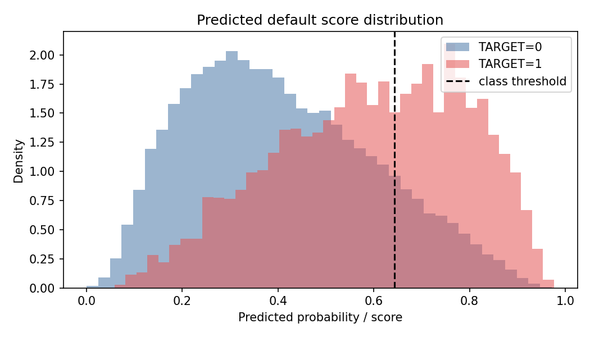
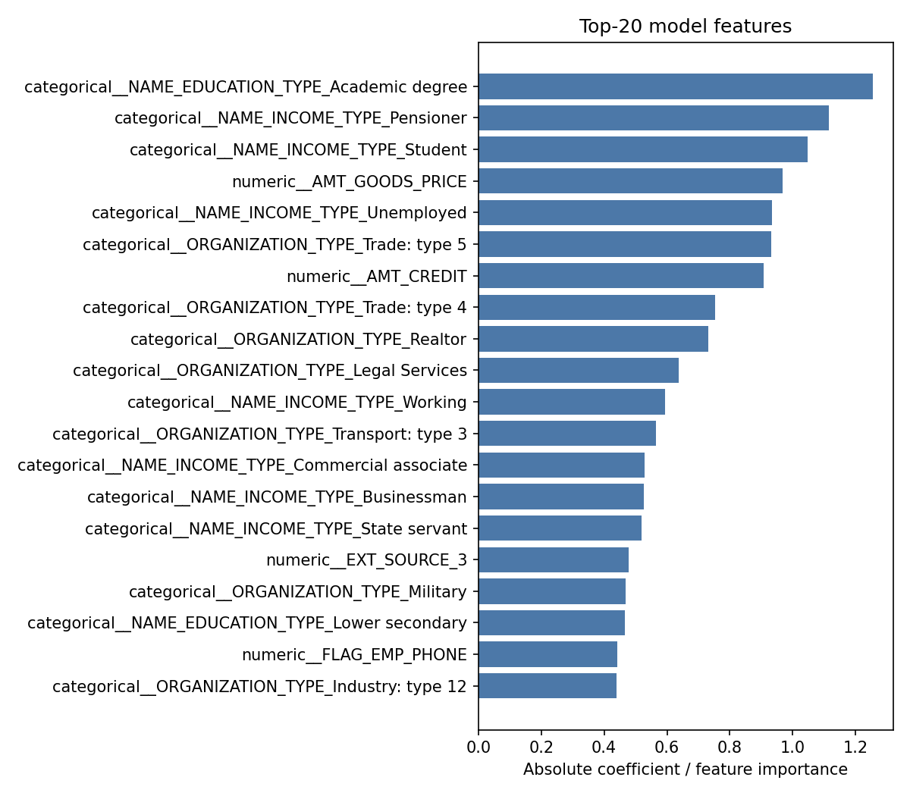

# Credit Scoring System — Home Credit Default Risk

Законченный учебный ML-проект оценки риска проблемного погашения кредита:
от EDA и построения признаков из реляционных таблиц до воспроизводимого
обучения, независимой holdout-оценки и CLI-инференса.

## Бизнес-задача

Модель ранжирует заявки по риску дефолта, чтобы кредитная организация могла
направлять заявки в разные процессы проверки и выбирать рабочий порог с
учётом стоимости false positive и false negative.

`TARGET=1` означает клиента с проблемами погашения кредита; `TARGET=0` —
клиента без такого события. Положительный класс составляет около 8.07%,
поэтому accuracy не используется как основная метрика. Главные метрики —
ROC-AUC и Average Precision (PR-AUC).

Проект не является готовой банковской decision system: он не задаёт цену
ошибок, кредитную политику, fairness-ограничения или регуляторные правила.

## Итог

В проекте есть два разных результата, которые важно не смешивать:

- **Research champion:** CatBoost с `application + POS_CASH`, полный
  3-fold CV ROC-AUC `0.761249 ± 0.001983`. Сохранённый ноутбучный PR-AUC
  для CatBoost равен `NaN`, а финальный артефакт этого эксперимента не был
  сохранён, поэтому он не объявляется production-ready моделью.
- **Выбранный воспроизводимый артефакт:** Logistic Regression на
  `application_train` в едином sklearn Pipeline. Для неё доступны реальные
  ROC-AUC и Average Precision на CV и независимом holdout, preprocessing
  входит в bundle, а train/evaluate/predict проверены через CLI.

Logistic Regression выбрана для демонстрационного инференса не потому, что
она максимизирует ROC-AUC, а потому, что это лучший **полностью проверенный и
переносимый** артефакт в текущем состоянии проекта.

### Метрики выбранного bundle

Обучение: 246 008 клиентов. Holdout: 61 503 клиента. Три
стратифицированных folds, `random_state=42`.

| Метрика | 3-fold CV | Holdout |
| --- | ---: | ---: |
| ROC-AUC | 0.744901 ± 0.002525 | 0.748600 |
| Average Precision | 0.217928 ± 0.005275 | 0.228541 |
| Brier score | — | 0.202536 |
| KS statistic | — | 0.372498 |
| Accuracy | — | 0.830464 |
| Precision | — | 0.222120 |
| Recall | — | 0.439678 |
| F1 | — | 0.295140 |

Порог `0.643364` максимизирует F1 на OOF-предсказаниях train-части и не
подбирался по holdout. Confusion matrix на holdout:

| Actual | Predicted 0 | Predicted 1 |
| --- | ---: | ---: |
| 0 | 48 893 | 7 645 |
| 1 | 2 782 | 2 183 |

Порог F1 — только технический default. В реальной кредитной политике его
нужно выбирать по стоимости ошибок и ограничениям бизнеса.

### Risk segments

Границы low/medium/high — 50-й и 80-й перцентили OOF score. Это
описательная сегментация, а не правило одобрения кредита.

| Segment | Клиентов holdout | Default rate | Mean score |
| --- | ---: | ---: | ---: |
| low | 30 855 | 2.97% | 0.2561 |
| medium | 18 441 | 8.50% | 0.4964 |
| high | 12 207 | 20.32% | 0.7251 |






## Данные

Используется Kaggle competition
[Home Credit Default Risk](https://www.kaggle.com/competitions/home-credit-default-risk).
CSV не распространяются с репозиторием.

Для baseline нужны:

```text
data/raw/application_train.csv
data/raw/application_test.csv
```

Для основной CatBoost+POS модели дополнительно нужен:

```text
data/raw/POS_CASH_balance.csv
```

Для полного набора признаков нужны:

```text
data/raw/bureau.csv
data/raw/bureau_balance.csv
data/raw/previous_application.csv
data/raw/installments_payments.csv
data/raw/POS_CASH_balance.csv
data/raw/credit_card_balance.csv
```

Скачайте архив со страницы competition и распакуйте CSV в `data/raw/`.
Также поддерживается структура:

```text
data/raw/home-credit-default-risk/application_train.csv
```

Файлы данных, Kaggle credentials и локальные выгрузки predictions исключены
из Git.

## Архитектура

```text
credit-scoring-system/
├── data/
│   ├── raw/                   # приватные исходные CSV
│   ├── interim/               # агрегаты исторических таблиц
│   └── processed/             # фиксированный client split
├── models/
│   ├── credit_scoring_model.joblib
│   └── credit_scoring_model_metadata.json
├── notebooks/
│   ├── 01_data_overview.ipynb
│   ├── 02_application_baseline.ipynb
│   ├── 03_bureau_features.ipynb
│   ├── 04_previous_application_features.ipynb
│   ├── 05_installments_features.ipynb
│   ├── 06_pos_cash_features.ipynb
│   ├── 07_credit_card_features.ipynb
│   └── 08_final_model.ipynb
├── reports/
│   ├── figures/
│   └── tables/
├── scripts/
│   └── check_colab_compatibility.py
├── src/
│   ├── config.py             # repo-relative пути
│   ├── dataset.py            # load, split, feature assembly
│   ├── features.py           # воспроизводимые агрегаты
│   ├── preprocessing.py      # единый train/inference preprocessing
│   ├── model_bundle.py       # модель + schema + threshold + risk bands
│   ├── metrics.py            # ROC/AP/Brier/KS/classification metrics
│   ├── train.py
│   ├── evaluate.py
│   ├── predict.py
│   └── validation.py
├── tests/
├── PROJECT_AUDIT.md
└── PROJECT_STATUS.md
```

## ML-процесс

1. Валидация ключа, `TARGET` и обязательных колонок.
2. Фильтрация исторических записей значениями времени `<= 0`.
3. Агрегация дополнительных таблиц до одной строки на `SK_ID_CURR`.
4. Фиксированный стратифицированный split 80/20.
5. CV только на train; holdout не участвует в выборе модели.
6. Logistic preprocessing внутри Pipeline:
   median imputation → scaling; most-frequent imputation → one-hot с
   `handle_unknown="ignore"`.
7. CatBoost preprocessing: строковый `Unknown` для категориальных null,
   числовые `NaN` обрабатывает CatBoost.
8. OOF ROC-AUC/AP и выбор технического F1-порога.
9. Финальный fit на всей train-части и однократная holdout-оценка.
10. Сохранение единого bundle, metadata, таблиц и диагностических figures.

В изученном pipeline явной утечки `TARGET` не найдено: `TARGET`,
`SK_ID_CURR` и `split` не передаются модели; feature tables не содержат
`TARGET`; merge выполняется с `validate="one_to_one"`.

## Установка

Поддерживаемое окружение: Python 3.10–3.12.

```bash
git clone https://github.com/lv19123/ml-portfolio.git
cd ml-portfolio/classical-ml/credit-scoring-system
python3 -m venv .venv
source .venv/bin/activate
python3 -m pip install --upgrade pip
python3 -m pip install -r requirements.txt
```

Windows PowerShell:

```powershell
py -3.10 -m venv .venv
.\.venv\Scripts\Activate.ps1
python -m pip install --upgrade pip
python -m pip install -r requirements.txt
```

Проект устанавливается editable, поэтому `src` и команды
`credit-train`, `credit-evaluate`, `credit-predict` доступны из любой
текущей директории внутри активированного окружения.

## Предсказания

Обучение внутри `predict.py` не выполняется.

```bash
python3 -m src.predict \
  --input data/raw/application_test.csv \
  --output predictions.csv
```

Результат:

```text
SK_ID_CURR
default_probability
predicted_class
risk_category
```

Можно передать другой bundle и порог:

```bash
python3 -m src.predict \
  --model models/credit_scoring_model.joblib \
  --input path/to/application_data.csv \
  --output predictions.csv \
  --threshold 0.70
```

Inference input должен содержать `SK_ID_CURR`, не должен содержать `TARGET`
и должен иметь признаки, ожидаемые моделью. Неизвестные категории baseline
обрабатываются без ошибки.

## Обучение

Воспроизводимый baseline:

```bash
python3 -m src.train \
  --model logistic \
  --features application \
  --cv-folds 3
```

Research configuration CatBoost+POS (CLI default):

```bash
python3 -m src.train
```

Эквивалентная полная команда:

```bash
python3 -m src.train \
  --model catboost \
  --features pos_cash \
  --cv-folds 3 \
  --iterations 996 \
  --device auto
```

Если `data/interim/pos_cash_features.csv` отсутствует, агрегаты
воспроизводимо строятся из raw CSV. На CPU полный CatBoost может выполняться
долго.

Smoke test нельзя сохранить поверх default-модели, поэтому нужны отдельные
пути:

```bash
python3 -m src.train \
  --model catboost \
  --features pos_cash \
  --cv-folds 2 \
  --iterations 20 \
  --device cpu \
  --train-sample-size 2000 \
  --holdout-sample-size 500 \
  --output models/catboost_smoke.joblib \
  --metadata-output models/catboost_smoke.json
```

Все пять дополнительных источников:

```bash
python3 -m src.train --model catboost --features all
```

## Оценка

Команда загружает сохранённую модель и фиксированный
`data/processed/client_split.csv`, затем оценивает только holdout:

```bash
python3 -m src.evaluate
```

Сохраняются:

- `reports/tables/final_evaluation.csv` и строгий JSON;
- confusion matrix;
- error analysis;
- risk-segment summary;
- feature importance;
- calibration, score distribution и confusion matrix plots.

## Тесты и инфраструктурные проверки

```bash
python3 -m pytest -q
python3 scripts/check_colab_compatibility.py --skip-data
python3 scripts/check_colab_compatibility.py
```

Тесты покрывают train/inference validation, обязательные колонки,
preprocessing, сохранение/загрузку bundle, неизвестные категории,
сохранение числа строк, диапазон probabilities, prediction schema, missing
files, метрики и notebook-контракты.

## Ноутбуки и Google Colab

Ноутбуки `01–08` сохранены как исследовательская история и не изменялись
при добавлении CLI. Их порядок:

```text
01 EDA
02 application baseline
03 bureau
04 previous_application
05 installments
06 POS_CASH
07 credit_card
08 all features
```

Для Colab:

```python
!git clone https://github.com/lv19123/ml-portfolio.git /content/ml-portfolio
%cd /content/ml-portfolio/classical-ml/credit-scoring-system
!python3 -m pip install -r requirements-colab.txt
```

Ноутбуки сами находят корень проекта и Google Drive. Запуски `02–07`
ожидают GPU в Colab. `08` при отсутствии GPU переходит в `cpu_debug`, чьи
метрики нельзя считать финальными.

## Ограничения

- Полный CatBoost+POS имеет лучший CV ROC-AUC, но его notebook PR-AUC
  сохранился как `NaN`; финальный CatBoost+POS bundle в ходе аудита не
  переобучался. Ветка проверена smoke test на 2 000/500 строках.
- All-features CatBoost был выполнен только в `cpu_debug`
  (50 000/15 000, 2 folds, 150 итераций); его метрики не финальные.
- Logistic Regression использует class weighting. Calibration curve и Brier
  score публикуются, но отдельная probability calibration не применялась;
  score нельзя напрямую трактовать как банковский PD.
- Risk bands основаны на квантилях OOF score и не являются кредитной
  политикой.
- Нет out-of-time или внешней validation, cost matrix, fairness и stability
  monitoring.
- В предоставленном рабочем каталоге отсутствовала `.git`, поэтому
  tracked/untracked статус файлов проверить было невозможно.
- `LICENSE` не выбран: владелец репозитория должен явно выбрать условия
  распространения перед публикацией.

## Дальнейшее развитие

1. Полностью переобучить CatBoost+POS с расчётом OOF Average Precision в
   Python по вероятностям, сохранить bundle и один раз оценить holdout.
2. Сравнить sigmoid/isotonic calibration только внутри train CV и принять
   её по Brier/log loss, не по holdout.
3. Добавить out-of-time validation и мониторинг PSI/data drift.
4. Определить threshold по бизнес cost matrix и ограничениям approval rate.
5. Провести fairness-анализ и документировать ограничения использования.
