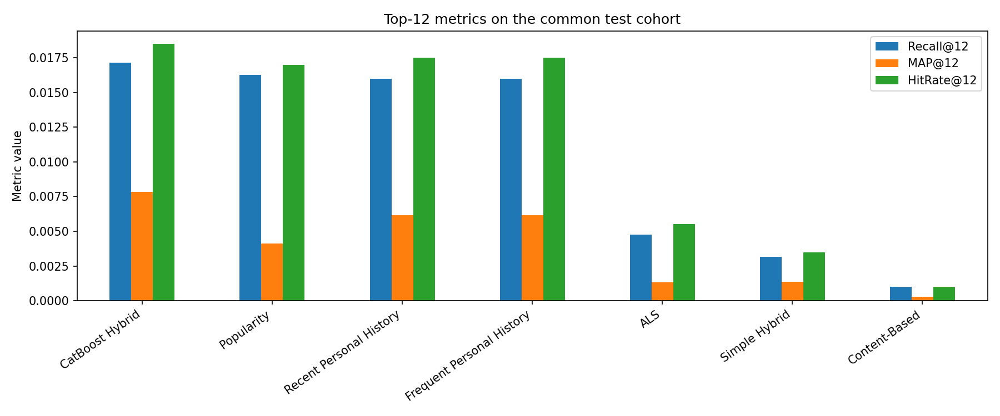

# Fashion Recommender System

Учебная рекомендательная система на данных **H&M Personalized Fashion Recommendations**. По истории покупок клиента проект формирует персональный список из **12 товаров на следующие семь дней**.

Это notebook-first pet-project уровня Strong Junior ML / Data Science, а не production-система маркетплейса. Основная ML-архитектура: **retrieval → features → CatBoost ranking → Top-12**.

## Задача

Покупки рассматриваются как implicit feedback: отсутствие покупки не означает отрицательную оценку товара. Система должна собрать небольшой candidate pool, оценить вероятность покупки каждой пары `customer_id + article_id` и вернуть пользователю уникальные Top-12 товаров.

## Архитектура

```text
User purchase history
        ↓
Temporal validation
        ↓
Candidate generation
 ├── ALS
 ├── Content-Based
 ├── Personal History
 └── Popularity
        ↓
Candidate merge + deduplication
        ↓
Feature engineering
 ├── User features
 ├── Item features
 ├── User-item features
 └── Category-affinity features
        ↓
CatBoostClassifier ranking
        ↓
Top-12 recommendations
        ↓
Popularity fallback
```

Candidate generators дают разные сигналы, после чего одинаковые user-item пары объединяются. CatBoostClassifier использует probability как ranking score внутри каждого пользователя. Короткие списки и неизвестные пользователи обрабатываются popularity fallback.

## Результаты

Все значения ниже получены на общем test cohort из **2 000 warm users** и сохранены в [`reports/tables/model_metrics.csv`](reports/tables/model_metrics.csv).

| Approach | Recall@12 | MAP@12 | HitRate@12 |
|---|---:|---:|---:|
| Popularity | 0.016250000 | 0.004118948 | 0.017000000 |
| Recent Personal History | 0.016000000 | 0.006148945 | 0.017500000 |
| Frequent Personal History | 0.016000000 | 0.006140611 | 0.017500000 |
| ALS | 0.004766667 | 0.001333232 | 0.005500000 |
| Content-Based | 0.001000000 | 0.000291667 | 0.001000000 |
| Simple Hybrid | 0.003166667 | 0.001369444 | 0.003500000 |
| **CatBoost Hybrid** | **0.017166667** | **0.007842298** | **0.018500000** |

**Best model: CatBoost Hybrid.**

Baselines лидируют по разным метрикам:

- **Popularity** — strongest baseline by Recall@12: `0.016250`;
- **Recent Personal History** — strongest personalized baseline и лучший baseline по MAP@12/HitRate@12: `0.016000 / 0.006149 / 0.017500`.

CatBoost Hybrid показывает лучшие point estimates:

- Recall@12 = `0.017167` — `+5.64%` относительно Popularity и `+7.29%` относительно Recent History;
- MAP@12 = `0.007842` — `+27.54%` относительно Recent History;
- HitRate@12 = `0.018500` — `+5.71%` относительно Recent History.

Final Candidate Recall@250 равен `0.057350`. Train ranking table содержит `445 008` candidate pairs и `154` retrieved positives; после negative sampling CatBoost обучается на `1 694` строках (`154` positives + `1 540` negatives). Сохранённая модель содержит 36 деревьев, best iteration `35` (zero-based), validation AUC `0.822267` и validation Logloss `0.108223` на выбранной итерации.

Улучшение Recall/HitRate над сильными baselines есть, но оно умеренное и не интерпретируется как статистически значимое.



## Основной вывод

Простая персональная история оказалась сильным baseline, а глобальная Popularity немного лидирует по Recall@12. ALS и Content-Based по отдельности уступили history baseline, но несколько retrieval-источников вместе увеличили покрытие candidate pool. CatBoost использовал признаки источников и взаимодействий и получил лучший итоговый Top-12 результат. Главный предел качества — Candidate Recall@250 `0.057350`, поэтому основной потенциал улучшения находится в candidate generation, а не в усложнении ranker.

## Dataset

Проект использует стороннюю копию **H&M Personalized Fashion Recommendations**, доступную через KaggleHub под идентификатором:

```text
sohyunjun0401/h-and-m-personalized-fashion-data
```

Фактический download-скрипт — [`create_data.py`](create_data.py). После установки зависимостей запустите его из корня проекта:

```bash
python create_data.py
```

Скрипт создаёт `data/raw/`, скачивает туда данные через `kagglehub.dataset_download()` и выводит список полученных файлов. Для pipeline нужны:

```text
data/raw/transactions_train.csv
data/raw/articles.csv
data/raw/customers.csv
```

Текущая локальная выгрузка содержит **1 048 575 транзакций только за 2019 год**. Это ограниченная сторонняя копия, а не полный официальный Kaggle competition dataset. Все опубликованные результаты относятся только к этому объёму данных и выбранному evaluation cohort.

Фактический `.gitignore` исключает raw/interim/processed data, обученные модели и mappings, generated recommendation artifacts и локальные caches. Небольшие итоговые таблицы в `reports/tables/` и графики в `reports/figures/` остаются в Git. После клонирования данные и ML-артефакты нужно подготовить локально.

## Validation and evaluation

Random split для рекомендательной системы позволил бы событиям из будущего попасть в историю, popularity statistics или пользовательские признаки. Поэтому используется temporal split: модель видит только события до cutoff, а покупки после cutoff становятся ground truth.

Финальный test protocol:

```text
History: все события до 2019-12-24 включительно
Target:  2019-12-25 — 2019-12-31
```

History используется для обучения retrieval-моделей, построения candidates и расчёта признаков. Future window используется только для target и offline evaluation.

Финальные метрики рассчитаны на воспроизводимой выборке из **2 000 warm users** — пользователей, у которых уже была история и есть покупка в target-периоде. Cold-start users не входят в эти offline ranking metrics, но во время inference получают рекомендации через popularity fallback.

Validation-window используется CatBoost для early stopping. Test-window не участвует в `.fit()` и применяется только для финальной оценки.

## Модели и признаки

### Candidate generation

- **ALS** — collaborative filtering по sparse user-item matrix и implicit confidence;
- **Content-Based** — cosine similarity между товарами и взвешенным профилем пользователя;
- **Recent Personal History** — последние уникальные покупки пользователя;
- **Frequent Personal History** — наиболее часто покупавшиеся товары;
- **Popularity** — глобально популярные товары и fallback.

После объединения остаётся не более 250 уникальных кандидатов на пользователя. Для каждой пары сохраняются score, rank, source flags и количество источников.

### Feature engineering

Ranking table содержит:

- user features: активность, число покупок, recency, среднюю цену, online share и возраст;
- item features: популярность, уникальных покупателей, recency и среднюю цену;
- user-item features: повторная покупка, frequency и recency пары;
- category-affinity features;
- scores, ranks и flags candidate generators.

Target равен 1, если сгенерированная user-item пара встретилась в соответствующем future window. Persisted ranking table содержит полный candidate pool; notebook 09 сохраняет все retrieved positives и воспроизводимо семплирует negatives только для CatBoost fit.

### Ranking

Финальный ranker — `CatBoostClassifier`. Его probability используется только как score для сортировки кандидатов внутри пользователя. После сортировки выбираются первые 12 уникальных товаров; если список короче, он дополняется popularity fallback.

## Метрики

- **Recall@12** — средняя доля уникальных future items, найденных в Top-12;
- **AP@12** — precision на позициях попаданий для одного пользователя;
- **MAP@12** — средний AP@12 по пользователям;
- **HitRate@12** — доля пользователей хотя бы с одним попаданием;
- **Candidate Recall@K** — доля ground-truth items, попавших в candidate pool до ranking.

Реализация и небольшие ручные примеры находятся в notebook 03 и `src/fashion_recommender/evaluation`.

## Notebook pipeline

Notebooks выполняются последовательно и передают компактные Parquet/JSON-артефакты следующему этапу. Этапы 07–09 не переобучают предыдущие модели.

| Notebook | Назначение | Основной результат |
|---|---|---|
| `01_data_overview_colab.ipynb` | Схемы, типы, пропуски, ключи и даты | Проверенные raw tables |
| `02_eda_colab.ipynb` | Время, цены, активность и категории | EDA и выводы |
| `03_temporal_validation_colab.ipynb` | Temporal split, ground truth и метрики | `temporal_windows.json` |
| `04_baselines_colab.ipynb` | Popularity, Recent и Frequent History | `baseline_metrics.csv` |
| `05_als_colab.ipynb` | Sparse implicit ALS | ALS candidates, model и mappings |
| `06_content_based_colab.ipynb` | Weighted content profiles и cosine similarity | Content candidates и encoder |
| `07_candidate_generation_colab.ipynb` | Merge, deduplication и source analysis | Merged candidates |
| `08_feature_engineering_colab.ipynb` | User/item/pair/affinity features и target | Ranking tables |
| `09_catboost_ranking_colab.ipynb` | CatBoost, scoring, Top-12 и fallback | Model, recommendations и metrics |
| `10_model_comparison_colab.ipynb` | Сравнение сохранённых экспериментов | Итоговая таблица и график |
| `11_batch_inference_colab.ipynb` | Дополнительный scoring сохранённой моделью | Необязательный batch demo |

Сохранённые execution results подтверждают core modeling pipeline 04–11. После исправления deterministic popularity повторно выполнена только затронутая цепочка 04 и 07–11; ALS и Content-Based из 05/06 не переобучались, поскольку от popularity ranking не зависят. Notebooks 01/02 не имеют outputs финального rerun, а execution provenance notebook 03 неполна; поэтому проект не утверждает, что все notebooks 01–11 были полностью выполнены в одном финальном запуске.

Artifact flow:

```text
03 → temporal_windows.json
      ├─→ 05 → als_candidates_{train,validation,test}.parquet
      └─→ 06 → content_candidates_{train,validation,test}.parquet

05 + 06 → 07 → merged_candidates_{train,validation,test}.parquet
                  ↓
                 08 → {train,validation,test}_ranking_table.parquet
                        ↓
                       09 → catboost_recommender.cbm
                            final_recommendations.parquet
                            catboost_metrics.csv
```

## Project structure

```text
fashion-recommender-system/
├── api/                         # FastAPI lookup готовых рекомендаций
├── artifacts/                   # generated recommendation files
├── data/
│   ├── raw/                     # downloaded CSV files
│   └── processed/               # candidates, windows и ranking tables
├── models/                      # trained models, configs и mappings
├── notebooks/                   # notebooks 01–11
├── reports/
│   ├── figures/                 # model comparison plot
│   └── tables/                  # реальные experiment metrics
├── scripts/                     # batch inference и notebook generator
├── src/fashion_recommender/     # reusable loading, metrics и inference code
├── tests/                       # unit и structural tests
├── create_data.py               # KaggleHub data download
├── PROJECT_EXPLANATION.md       # подробное учебное объяснение
├── pyproject.toml
├── requirements.txt
├── README.md
└── .gitignore
```

## How to run

### 1. Clone

```bash
git clone https://github.com/lv19123/ml-portfolio.git
cd ml-portfolio/classical-ml/fashion-recommender-system
```

### 2. Environment

```bash
python -m venv .venv
source .venv/bin/activate
python -m pip install --upgrade pip
pip install -r requirements.txt
pip install -e .
```

`scikit-learn==1.6.1` зафиксирован намеренно: сохранённый Content-Based encoder был создан и проверен на этой версии, поэтому pin предотвращает `InconsistentVersionWarning` при локальном воспроизведении artifacts.

Для Windows PowerShell команда активации:

```powershell
.venv\Scripts\Activate.ps1
```

### 3. Data

```bash
python create_data.py
```

Перед запуском notebooks проверьте наличие трёх CSV в `data/raw/`.

### 4. Notebooks

Откройте notebooks из корня проекта и выполните основной pipeline по порядку:

```text
01 → 02 → 03 → 04 → 05 → 06 → 07 → 08 → 09 → 10
```

Notebook 11 — дополнительная демонстрация batch scoring и для воспроизведения основных экспериментов не требуется.

В Google Colab поместите проект в `MyDrive/fashion-recommender-system`. Первая ячейка каждого notebook подключает Google Drive, определяет `PROJECT_ROOT` и устанавливает зависимости из `requirements.txt`.

Data, processed Parquet, models и recommendation artifacts не хранятся в Git. Новый пользователь сначала получает raw data, затем выполняет notebooks в указанном порядке; каждый modeling notebook сохраняет локальные artifacts для следующего этапа.

### 5. Tests

Тесты не требуют полного H&M dataset:

```bash
pytest -q
```

Дополнительная проверка синтаксиса:

```bash
python -m compileall -q src api scripts
```

## Optional batch inference and API

После выполнения основного pipeline сохранённые модели можно использовать для пакетного пересчёта:

```bash
python scripts/batch_inference.py --project-root .
```

API не обучает модели и не выполняет тяжёлый scoring внутри HTTP-запроса. Он загружает готовый `artifacts/final_recommendations.parquet` и делает lookup:

```bash
PYTHONPATH=src:. uvicorn api.main:app --host 0.0.0.0 --port 8000
```

Endpoints:

- `GET /health`;
- `GET /recommend/{customer_id}?k=12`;
- `GET /model-info`.

## Limitations

1. **Evaluation cohort.** Основные результаты рассчитаны на 2 000 warm users, а не на всех пользователей набора данных. Cold-start users исключены из ranking evaluation.
2. **Evaluation scope.** Итоговая оценка использует один test window `2019-12-25 — 2019-12-31`, поэтому не измеряет стабильность качества на нескольких временных срезах.
3. **Candidate Recall.** Candidate Recall@250 равен `0.057350`, то есть примерно **5.735%**. Retrieval — главный bottleneck: ranker не может вернуть релевантный товар, отсутствующий в candidate pool.
4. **Ranking positives.** Train candidate table содержит `445 008` строк, но только **154 retrieved positive pairs**. После negative sampling CatBoost fit использует 1 694 строки.
5. **Absolute quality.** Итоговый Recall@12 равен `0.017167`, поэтому абсолютное offline-качество остаётся низким.
6. **Baseline difference.** CatBoost лучший по всем трём Top-12 point estimates, но преимущество над сильными baselines умеренное по Recall/HitRate; статистическая значимость не проверялась.
7. **Dataset scope.** Эксперименты относятся к ограниченной сторонней версии данных за 2019 год, а не к полному competition dataset.
8. **Offline assumptions.** Покупка не измеряет причинный эффект показа; availability, stock, скидки и позиция товара в интерфейсе не моделируются.
9. **Content representation.** One-hot категории не используют изображения, свободный текст или более глубокое представление стиля.

Подробное объяснение решений и вопросы для подготовки к собеседованию находятся в [`PROJECT_EXPLANATION.md`](PROJECT_EXPLANATION.md).
